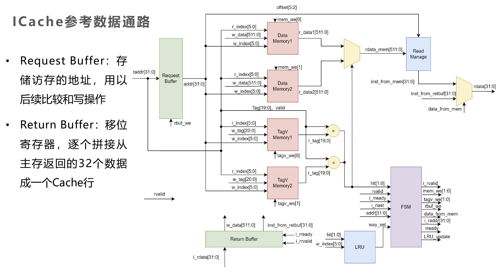
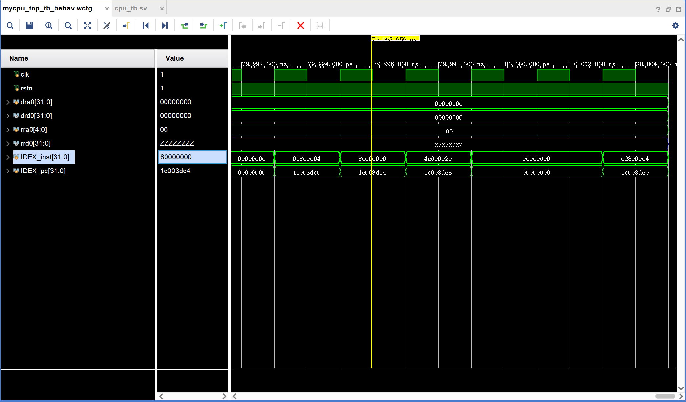

# ICache实验报告
PB22020514 郭东昊

## 实验目的
- 掌握Cache工作原理、基本结构、设计和调试方法
- 熟练掌握数据通路和控制器的设计和描述方法

## 实验内容
改造5级流水线LA32R CPU，增加指令cache
- 容量8KB，块式存储器
- 块大小：4字（16字节）
- 地址映射方式：2路组相联
- 替换策略：伪随机/LRU

## 数据通路
总体参照马子睿助教给出的参考数据通路，部分信号变量进行了重命名。


## ICache时序设计思路

ICache设计主要包括CPU和ICache的通信以及状态机的设计。以下是详细的设计思路：

### CPU和ICache的通信

CPU和ICache的通信主要包括发地址和收指令两个部分。

#### 发地址

- 在无异常的情况下，每一拍持续送出raddr（虚地址 取PC[31:0]而非之前的[31:2]）。一旦检测到addr_ready为1，则置addr_valid为1。
- inst_ready为1。
- 当icache检测到addr_valid为1，开始读取地址。如果命中，icache将inst_valid置1，cpu接收指令，下一拍继续取指。否则，icache进入MISS状态，将inst_valid置0，cpu流水线需要等待。inst_ready始终为1，等待icache的inst_valid置1。
- 如果这一拍，icache命中，一切正常。如果这一拍，icache未命中，下一拍流水线需要暂停，则这一拍cpu置fstall。

#### 收指令

- 如果命中，这一拍经过icache的读取，cpu读到指令。
- 如果未命中，inst_ready始终为1，等待icache的inst_valid置1。在inst_valid置1的当拍，cpu读到指令。

### 状态机设计

状态机主要包括LOOKUP、MISS和REFILL三个状态。

#### LOOKUP状态

- 在LOOKUP状态，读取地址，判断是否命中，在这一拍给出读取的数据。
- addr_ready = 1。
- inst_valid 根据是否命中置是否有效。
- request buffer写使能命中置0，不命中置1。
- 如果未命中，inst_mem_raddr置为块起始地址，return buffer清零，准备好下一拍进入MISS状态。
- 如果命中，下一拍还为LOOKUP状态，保证连续读取。对应行的recently_hit置为路号。

#### MISS状态

- 在MISS状态，这一拍读到来自IMEM异步给出的数据，并在return buffer进行拼接，inst_mem_raddr在下一拍递增，重复此过程，直到拼接完成。
- 对于这一拍读到的数据，下一拍return buffer才会锁存并进行拼接。
- 关闭request buffer写使能，同时addr_ready置0。
- 拼接完成信号：is_i_last = (inst_mem_raddr == 块结束地址) 组合逻辑。
- 如果这一拍，inst_mem_raddr == cache锁存的raddr_reg，寄存器inst_from_retbuf更新，并锁存。
- 如果这一拍，is_i_last = 1，下一拍进入REFILL状态。

#### REFILL状态

- 在REFILL状态，这一拍，置选择信号is_data_from_cache为0，且置inst_valid = 1，使得cpu读取从IMEM加载的正确指令。
- 这一拍，根据windex对应行的recently_hit置相应路号的写使能，进行替换。

## 代码

### data_way.sv

```verilog
module data_way (
    input wire clk,
    input wire rstn,
    input wire [7:0] rindex,
    input wire [7:0] windex,
    input wire [127:0] wdata,
    input wire we,
    output wire [127:0] rdata
);
    
reg [127:0] data [0:255];

always @(posedge clk) begin
    if (~rstn) begin
        integer i;
        for (i = 0; i < 256; i = i + 1) begin
            data[i] <= 128'h0;
        end
    end else begin
        if (we) begin
            data[windex] <= wdata;
        end
    end
end

assign rdata = data[rindex];

endmodule
```

### tagv_way.sv

```verilog
module tagv_way (
    input wire clk,
    input wire rstn,
    input wire [7:0] rindex,
    input wire [7:0] windex,
    input wire [19:0] wtag,
    input wire we,
    output wire [19:0] rtag,
    output wire rvalid
);
    
reg [20:0] tagv [0:255];

always @(posedge clk) begin
    if (~rstn) begin
        for (integer i = 0; i < 256; i = i + 1) begin
            tagv[i] <= 21'h0;
        end
    end else begin
        if (we) begin
            tagv[windex] <= {wtag,1'b1};
        end
    end
end


assign rtag = tagv[rindex][20:1];
assign rvalid = tagv[rindex][0];


endmodule
```

### ICache.sv

```verilog
//接口声明
module icache (
    //和CPU的接口
    input  wire        clk,
    input  wire        rstn,
    input  wire [31:0] raddr,
    output wire [31:0] rdata,
    output reg         addr_ready,
    input  wire        addr_valid,      //接收cpu发的地址
    output wire        inst_valid,
    input  wire        inst_ready,      //向cpu发指令
    //和主存的接口
    output reg  [31:0] inst_mem_raddr,
    input  wire [31:0] inst_mem_rdata
);

......

//输出控制信号的三段式状态机
  //Finite State Machine: Part1
  always @(posedge clk) begin
    if (!rstn) begin
      state <= LOOKUP;
    end else begin
      state <= next_state;
    end
  end

  //Part2
  always @(*) begin
    case (state)
      LOOKUP: begin
        if (valid && miss) next_state = MISS;
        else next_state = LOOKUP;
      end
      MISS: begin
        if (is_i_rlast) next_state = REFILL;
        else next_state = MISS;
      end
      REFILL: begin
        next_state = LOOKUP;
      end
      default: begin
        next_state = LOOKUP;
      end
    endcase
  end

  //Part3
  always @(*) begin
    case (state)
      LOOKUP: begin
        addr_ready = rstn;
        return_buffer = 128'h0;
        inst_mem_raddr_we = 1'b1;
        // inst_mem_raddr = {raddr[31:4], 2'b00};
      end
      MISS: begin
        // inst_mem_raddr = inst_mem_raddr + 1;
        addr_ready = 1'b0;
        retbuf_we = 1'b1;
        inst_mem_raddr_we = 1'b1;
      end
      REFILL: begin
        addr_ready = 1'b0;
        retbuf_we  = 1'b0;
        inst_mem_raddr_we = 1'b0; 
      end
    endcase
  end

......

//LRU regs
  always @(posedge clk) begin
    if (!rstn) begin
      integer i;
      for (i = 0; i < 256; i = i + 1) begin
          recently_hit_way[i] <= 1'b0;
      end
    end else if ((state == LOOKUP) && !miss) begin
      recently_hit_way[rindex] <= hit_way2;
    end
  end

  //refill signals
  assign wdata = return_buffer;
  assign wtag = raddr_reg[31:12];
  assign windex = raddr_reg[11:4];
  assign way_to_be_replaced = !recently_hit_way[windex];

//return buffer
  always @(posedge clk) begin
    if (!rstn) begin
      return_buffer <= 128'b0;
    end else if (retbuf_we) begin
      return_buffer <= {inst_mem_rdata, return_buffer[127:32]};
      if (inst_mem_raddr == raddr_reg[31:2]) begin
        inst_from_retbuf <= inst_mem_rdata;
      end
    end
  end
```

## 实验结果

经过picoLA32r对cpu进行测试，ICache正常工作，能够正确读取指令。

如图，IDEX级指令经过足够多的时钟周期，最后出现了80000000，说明指令读取正常，通过了所有指令的测试



## 实验总结

在这次实验中，我深入理解了Cache的工作原理、基本结构、设计和调试方法，以及数据通路和控制器的设计和描述方法。我成功地改造了5级流水线LA32R CPU，增加了指令cache。

在实验过程中，我遇到了一些挑战，例如在设计CPU和ICache的通信以及状态机的设计时，需要仔细考虑每个步骤的逻辑和顺序。

实验结果显示，ICache正常工作，能够正确读取指令，通过了所有指令的测试。

总的来说，这次实验提高了我的verilog编程技能，增强了我对Cache和CPU设计的理解。